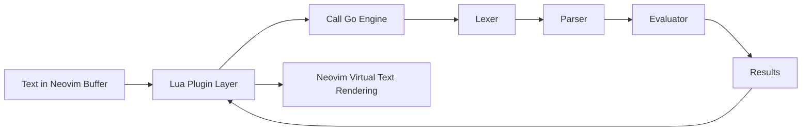

# 📑 vimath.nvim – A Text-Based Calculator for Neovim

## 📌 Project Summary

**vimath.nvim** is a Neovim plugin inspired by [NoteCalc](https://bbodi.github.io/notecalc3/) that allows you to write plain text containing assignments and expressions, and automatically view the calculated results **aligned in a column inside Neovim**.

Unlike a traditional calculator, **the original text remains untouched**. The plugin displays results as _virtual text annotations_, keeping the buffer clean while still giving immediate feedback.

This project is intentionally **overengineered** for the relatively simple problem of "calculate expressions in text".  
The real goal is **learning by building**:

- Designing a **mini language** (syntax + semantics).
- Implementing a **lexer, parser, and evaluator**.
- Integrating the language engine into Neovim via a plugin.
- Later: rebuilding in **Zig** to explore performance and systems-level fundamentals.

## 💡 Motivation

- ✨ **Inspiration**: This project is heavily inspired by _NoteCalc_. NoteCalc is a web-based notepad calculator. The idea here is to build a personal, Neovim-native alternative.
- 🎯 **Personal Goal**: I’ve always liked the idea of mixing text and calculations. It feels natural and helps in day-to-day tasks (budgets, quick notes, project estimations).
- 📚 **Learning Focus**:
  - Understand the **mechanisms of compilers/interpreters** (lexer → parser → evaluator).
  - Explore **plugin development in Neovim**.
  - Learn **Go** for the core engine and later **Zig** for performance/system insights.

> ⚠️ **Important Disclaimer**:  
> This project is **not about the output itself** (calculating numbers in text).  
> The project is **about the process** of creating a small language and integrating it into Neovim.  
> The end result is a by-product — the real product is the learning journey.

## 🖥️ Demonstration (Markdown Example)

Input written in a Neovim buffer:

```txt
valor1 = 5.50
valor2 = 10.50
valor3 = (valor1 * 0.99) - (valor2 * 1.2)
```

What you would see in Neovim (virtual text aligned to the right):

```txt
valor1 = 5.50                                 ▏5.50
valor2 = 10.50                                ▏10.50
valor3 = (valor1 * 0.99) - (valor2 * 1.2)     ▏-7.155
```

The `▏` marker represents the virtual text column — results are **not saved in the file**.

## 🛠️ Stack & Technologies

| Layer            | Technology       | Purpose                                                                 |
| ---------------- | ---------------- | ----------------------------------------------------------------------- |
| **Core Engine**  | Go               | Implementation of lexer, parser, evaluator.                             |
| **Plugin Layer** | Lua (Neovim API) | Extract expressions from buffer, call Go engine, render results.        |
| **Future**       | Zig              | Re-implement interpreter focusing on memory management and performance. |

## 🏗️ Architecture Overview

### 🔹 Current Architecture



**Components:**

1. **Lexer (Go)**

   - Reads raw text line by line.
   - Converts it into tokens (identifiers, operators, numbers, parentheses).

2. **Parser (Go)**

   - Converts token streams into an AST (abstract syntax tree).
   - Handles precedence rules, parenthesis, assignment.

3. **Evaluator (Go)**

   - Walks the AST and computes values.
   - Stores variables in a symbol table.

4. **Lua Plugin (Neovim)**

   - Monitors buffer changes.
   - Sends expressions to Go engine.
   - Displays results using `nvim_buf_set_extmark` (virtual text).

### 🔹 Future Architecture (with Zig)

Planned future version built in **Zig** to learn:

- **Explicit memory management**
- **Performance optimizations**

## 🚀 Roadmap

### 📋 Version Overview

| Version | Focus               | Status         | Key Deliverables               |
| ------- | ------------------- | -------------- | ------------------------------ |
| **v1**  | Core Implementation | 🚧 In Progress | Go interpreter + Neovim plugin |
| **v2**  | Performance         | 📅 Planned     | Zig rewrite                    |

---

### 🎯 v1 - Core Implementation

#### 🔧 Phase 1: Core Interpreter (Go)

| Component          | Tasks                                    |
| ------------------ | ---------------------------------------- |
| **Lexer**          | Tokenize identifiers, numbers, operators |
| **Parser**         | Basic expressions, precedence handling   |
| **Evaluator**      | Symbol table, arithmetic, variables      |
| **Error Handling** | Undefined variables, invalid syntax      |

#### 🔌 Phase 2: Neovim Plugin (Lua)

| Feature                  | Description                        |
| ------------------------ | ---------------------------------- |
| **Buffer Extraction**    | Extract relevant lines from buffer |
| **Engine Integration**   | Call Go engine                     |
| **Virtual Text Display** | Align results to the right         |

---

### ⚡ v2 - Performance

#### 🦎 Zig Implementation

> **Goal**: Learn explicit memory management and performance optimization

## 🚀 Running the Code

### Prerequisites

- Go 1.19+ installed on your system

### Command Line Usage

The core interpreter can be run from the project root directory using:

```bash
go run core/*.go --file <filename>
```

The `--file` parameter specifies which file to parse from the `examples/` directory.

#### Examples:

```bash
# Run with the default example file
go run core/*.go --file example1.txt

# Run with parser test files
go run core/*.go --file parser1.txt
go run core/*.go --file parser2.txt
go run core/*.go --file parser3.txt
go run core/*.go --file parser4.txt
```

#### Available Test Files:

- `example1.txt` - Real-world usage example with comments and complex expressions
- `parser1.txt` - Basic arithmetic operations (addition, subtraction)
- `parser2.txt` - Operator precedence testing (multiplication, mixed operations)
- `parser3.txt` - Edge cases and complex scenarios (unary operators, division, nested parentheses)
- `parser4.txt` - Error cases and boundary conditions

## 📂 Repository Structure

```plaintext
vimath.nvim/
├── core/                # Core interpreter (Go)
│   ├── lexer.go
│   ├── parser.go
│   ├── evaluator.go
│   └── main.go
├── plugin/              # Neovim plugin (Lua)
│   ├── init.lua
│   └── utils.lua
├── examples/            # Example input files
│   ├── example1.txt
│   ├── parser1.txt
│   ├── parser2.txt
│   ├── parser3.txt
│   └── parser4.txt
├── docs/                # Documentation
└── README.md            # This document
```

## 📖 Relevant Notes

- **Integration Model**:
  Initially, Go will be compiled into a binary that Lua calls via `jobstart()`.

- **Overengineering Acknowledged**:
  The project’s main function (evaluate expressions in text) could be solved with simpler tools (like Lua `load()`), but the deliberate choice is to **overengineer for learning purposes**.

- **Career Relevance**:
  This project showcases both _practical problem solving_ and _deep technical exploration_. It balances immediate utility (plugin) with long-term educational value (language implementation).

## 📌 Final Thoughts

This project's expected output is to learn:

- How interpreters work.
- How Neovim plugins integrate with external tools.
- How different languages (Go vs Zig) change the way you think about performance and memory.

It solves a real workflow pain point (calculations inline in notes), but more importantly, it builds the foundation for deeper system-level knowledge.
